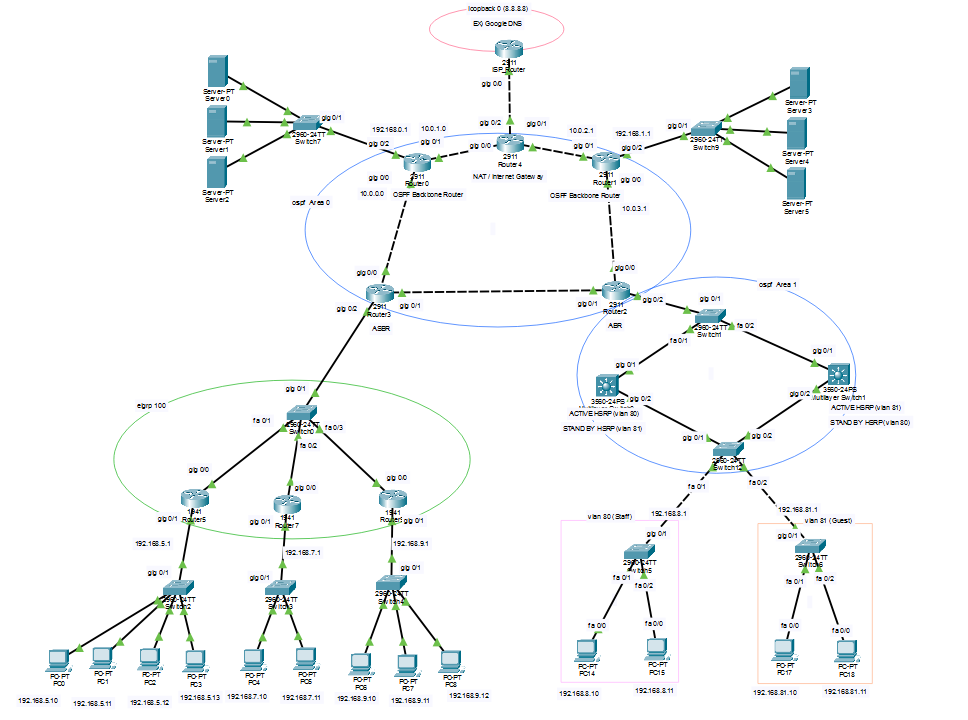

# Packet Route: Network Topology Simulation

> **Enterprise-Grade Network Infrastructure Design & Simulation**

**Packet Route** is a network infrastructure simulation project designed to build a highly available and secure network environment. It focuses on interconnecting different routing protocols, ensuring gateway redundancy, and enforcing security policies using Cisco network devices.

## 📅 Project Context
* **Type**: Network Infrastructure / Simulation
* **Tools Used**: Cisco Packet Tracer, Cisco IOS
* **Key Concepts**: OSPF, EIGRP, HSRP, VLAN, ACL, Redistribution

---

## 🏗️ Network Architecture & Design

### 1. Protocol Redistribution (OSPF ↔ EIGRP)
* **Goal**: Enable communication between different Autonomous Systems (AS).
* **Implementation**: Configured **Route Redistribution** on the ASBR (Autonomous System Boundary Router).
* **Result**: Successfully merged the OSPF domain and EIGRP domain, allowing full connectivity across the entire network infrastructure.

### 2. Gateway Redundancy (HSRP)
* **Goal**: Ensure High Availability (HA) and Load Balancing.
* **Implementation**: Deployed **HSRP (Hot Standby Router Protocol)** using L3 Switches.
    * Configured **Active/Standby** roles for different VLANs to distribute traffic load.
* **Result**: Achieved failover capability where a standby gateway immediately takes over if the active gateway fails.

### 3. Security & L2 Stability
* **Access Control Lists (ACL)**:
    * **Guest VLAN**: Restricted to Internet access only; blocked from internal network resources.
    * **Network Separation**: Enforced strict traffic policies between VLANs.
* **Native VLAN Configuration**:
    * Changed Native VLAN to ID `999` across all switches.
    * **Result**: Mitigated **VLAN Hopping attacks** and prevented L2 protocol inconsistencies.

---

## 🚀 Troubleshooting & Issues

### 1. HSRP Split-Brain Scenario
* **Issue**: Both redundant routers claimed the "Active" state, causing IP conflicts and network instability.
* **Cause**: A mismatch in **Native VLAN** settings during the initial Router-on-a-Stick (ROAS) configuration caused HSRP Hello packets to be dropped.
* **Solution**:
    * Replaced the legacy Router architecture with **L3 Switches**.
    * Migrated to **SVI (Switch Virtual Interface)** based routing.
    * **Outcome**: Resolved the physical/functional constraints and established a stable logical topology.

### 2. EIGRP Default Route Propagation Failure
* **Issue**: PCs within the EIGRP network could not access the external Internet.
* **Cause**: EIGRP does not automatically redistribute external default routes (e.g., `O*E2`) learned from OSPF.
* **Solution**:
    * Applied the `ip summary-address eigrp` command on the ASBR.
    * **Outcome**: Successfully propagated the default route to the EIGRP domain, restoring Internet connectivity.

---

## 🛠️ Tech Stack & Skills
* **Network Simulation**: Cisco Packet Tracer
* **Routing Protocols**: OSPF, EIGRP, Static Routing
* **Switching & HA**: VLAN, Trunking, EtherChannel, HSRP
* **Security**: Standard/Extended ACL, Port Security

---

# 📖 Detailed Technical Reference

## 1\. 🎯 Project Overview

This project is a **complex routing-based enterprise internal network simulation** that integrates OSPF Multi-Area and EIGRP Autonomous Systems (AS), along with centralized NAT and HSRP gateway redundancy.

The goal is to simulate a real-world scenario where enterprise networks using different routing protocols — resulting from M&A (Mergers & Acquisitions) — are unified under a single architecture with High Availability (HA) and security policies applied.

### 1.1. 📍 Final Architecture

The network consists of 3 independent routing domains and 1 internet gateway.

| Zone | Devices | Protocol | Role |
| :---: | :---: | :---: | :--- |
| **Backbone (Core)** | R0, R1, R2, R3, R4 | **OSPF Area 0** | High-speed network backbone (Core) |
| **Internet Gateway** | R4 | **NAT / OSPF** | Centralized internet access & default route propagation |
| **Branch Group 1** | R3, R5, R7, R9 | **EIGRP 100** | Branch group redistributed with OSPF (ASBR) |
| **Branch Group 2** | R2, L3\_Sw8, L3\_Sw6 | **OSPF Area 1** | HSRP-redundant branch (ABR) |

### 1.2. 🚀 Key Implementation Technologies

  * **Route Redistribution:** Bidirectional OSPF ↔ EIGRP redistribution at `R3` (ASBR)
  * **OSPF Multi-Area:** Separation of Area 0 (backbone) and Area 1 (branch) via `R2` (ABR)
  * **High Availability (HSRP):** Per-VLAN HSRP Load Balancing using SVIs on `L3_Switch_8/6`
  * **NAT (PAT):** Centralized internet gateway using ROAS at `R4`
  * **L2 Security:** Native VLAN (999) applied to `Switch12` and downstream switches to resolve L2 conflicts
  * **Security (ACL):** ACL policy restricting `VLAN 81 (Guest)` to internet-only access (`8.8.8.8`)

-----

## Architecture Diagram


-----

## 2\. 🐛 Key Troubleshooting & Lessons Learned

### 2.1. Issue 1: Internet Route Propagation Failure Between EIGRP ↔ OSPF

  * **Symptom:** `Destination host unreachable` when pinging `8.8.8.8` (internet) from EIGRP branch (`R5`).
  * **Root Cause:** `R3` (ASBR) learned the default route (`O*E2 0.0.0.0/0`) advertised by `R4` (NAT GW) via OSPF, but did not redistribute it into EIGRP. EIGRP does not redistribute default routes by default.
  * **Resolution:** Added `ip summary-address eigrp 100 0.0.0.0 0.0.0.0` on `R3`'s EIGRP interface (`Gi0/2`) to force-inject the default route into the EIGRP domain.

### 2.2. Issue 2: HSRP "Split-Brain"

  * **Symptom:** `show standby brief` on both `R8` and `R6` showed `Standby unknown`, with both routers claiming `Active` state.
  * **Root Cause (Packet Tracer Limitation):** The `1941` router does not support the `vlan` database command, causing `encapsulation dot1Q` (ROAS) to malfunction. This resulted in a `Native VLAN Mismatch` with `Switch12`, causing HSRP Hello packets to be dropped.
  * **Resolution:** Replaced the HSRP gateway devices from `1941 routers` to **`Layer 3 Switches (3560/3650)`**. Configured HSRP using **SVIs (`interface Vlan80`)**, overcoming the ROAS limitation and immediately resolving the issue.

### 2.3. Issue 3: Communication Failure Between OSPF Area 1 ↔ EIGRP

  * **Symptom:** Ping failed (`Request timed out`) from `R8` (OSPF Area 1) PC to `R5` (EIGRP) PC.
  * **Root Cause:** OSPF Area 1 was configured as a `stub` area. OSPF Stub Areas block external routes (`O E2`), so the EIGRP routes (`O E2 192.168.5.0`, etc.) redistributed by `R3` (ASBR) were blocked at `R2` (ABR).
  * **Resolution:** Changed OSPF Area 1 from `stub` to a **"Normal Area"** (`no area 1 stub`), allowing EIGRP external routes to be learned within Area 1.

-----

## 3\. 💾 Final Configuration Scripts

### 3.1. R4 (Internet GW / NAT)

```cisco
hostname Router4
enable secret class
no ip domain-lookup
ip routing
!
vlan 4
 name R4_LAN
vlan 200
 name ISP_WAN_Link
!
interface GigabitEthernet0/0
 ip address 10.0.1.4 255.255.255.0
 ip ospf 1 area 0
 no shutdown
!
interface GigabitEthernet0/1
 ip address 10.0.2.4 255.255.255.0
 ip ospf 1 area 0
 no shutdown
!
interface GigabitEthernet0/2
 no ip address
 no shutdown
!
interface GigabitEthernet0/2.4
 encapsulation dot1Q 4
 ip address 192.168.4.1 255.255.255.0
 ip nat inside
 no shutdown
!
interface GigabitEthernet0/2.200
 encapsulation dot1Q 200
 ip address 200.0.0.2 255.255.255.252
 ip nat outside
 no shutdown
!
interface FastEthernet0/1/0
 switchport mode access
 switchport access vlan 200
 no shutdown
!
interface FastEthernet0/1/1
 switchport mode access
 switchport access vlan 4
 no shutdown
!
interface FastEthernet0/1/3
 switchport mode trunk
 no shutdown
!
router ospf 1
 network 192.168.4.0 0.0.0.255 area 0
 default-information originate
!
ip route 0.0.0.0 0.0.0.0 200.0.0.1
!
ip access-list extended ACL_FOR_NAT
 permit ip 192.168.0.0 0.0.255.255 any
 permit ip 10.3.0.0 0.0.0.255 any
!
ip nat inside source list ACL_FOR_NAT interface GigabitEthernet0/2.200 overload
!
end
```

### 3.2. R3 (ASBR: OSPF ↔ EIGRP)

```cisco
hostname Router3
enable secret class
no ip domain-lookup
ip routing
!
interface GigabitEthernet0/0
 ip address 10.0.0.3 255.255.255.0
 ip ospf cost 1
 ip ospf 1 area 0
 no shutdown
!
interface GigabitEthernet0/1
 ip address 10.0.4.3 255.255.255.0
 ip ospf 1 area 0
 no shutdown
!
interface GigabitEthernet0/2
 ip address 10.3.0.3 255.255.255.0
 no shutdown
!
router ospf 1
 network 10.0.0.0 0.0.0.255 area 0
 network 10.0.4.0 0.0.0.255 area 0
 redistribute eigrp 100 subnets
!
router eigrp 100
 no auto-summary
 network 10.3.0.0 0.0.0.255
 network 192.168.3.0 0.0.0.255
 redistribute ospf 1 metric 10000 100 255 1 1500
 interface GigabitEthernet0/2
  ip summary-address eigrp 100 0.0.0.0 0.0.0.0
!
end
```

### 3.3. R2 (ABR: OSPF Area 0 ↔ Area 1)

```cisco
hostname Router2
enable secret class
no ip domain-lookup
ip routing
!
interface GigabitEthernet0/0
 ip address 10.0.3.2 255.255.255.0
 ip ospf 1 area 0
 no shutdown
!
interface GigabitEthernet0/1
 ip address 10.0.4.2 255.255.255.0
 ip ospf 1 area 0
 no shutdown
!
interface GigabitEthernet0/2
 ip address 10.2.0.2 255.255.255.0
 ip ospf 1 area 1
 no shutdown
!
router ospf 1
 network 10.0.3.0 0.0.0.255 area 0
 network 10.0.4.0 0.0.0.255 area 0
 network 10.2.0.0 0.0.0.255 area 1
!
end
```

### 3.4. L3\_Switch\_8 (HSRP Active - VLAN 80)

```cisco
hostname L3_Switch_8
enable secret class
no ip domain-lookup
ip routing
!
vlan 80
 name Staff
vlan 81
 name Guest
vlan 999
 name Native_Dummy
!
interface GigabitEthernet0/1
 no switchport
 ip address 10.2.0.8 255.255.255.0
 no shutdown
!
interface GigabitEthernet0/2
 switchport mode trunk
 switchport trunk native vlan 999
 no shutdown
!
interface Vlan80
 ip address 192.168.8.2 255.255.255.0
 standby 80 ip 192.168.8.1
 standby 80 priority 150
 standby 80 preempt
!
interface Vlan81
 ip address 192.168.81.2 255.255.255.0
 ip access-group GUEST_POLICY_IN in
 standby 81 ip 192.168.81.1
 standby 81 priority 100
 standby 81 preempt
!
router ospf 1
 network 10.2.0.0 0.0.0.255 area 1
 network 192.168.8.0 0.0.0.255 area 1
 network 192.168.81.0 0.0.0.255 area 1
!
ip access-list extended GUEST_POLICY_IN
 permit ip 192.168.81.0 0.0.0.255 host 8.8.8.8
 deny   ip 192.168.81.0 0.0.0.255 192.168.0.0 0.0.255.255
 deny   ip 192.168.81.0 0.0.0.255 10.0.0.0 0.255.255.255
!
end
```

### 3.5. L3\_Switch\_6 (HSRP Active - VLAN 81)

```cisco
hostname L3_Switch_6
enable secret class
no ip domain-lookup
ip routing
!
vlan 80
 name Staff
vlan 81
 name Guest
vlan 999
 name Native_Dummy
!
interface GigabitEthernet0/1
 no switchport
 ip address 10.2.0.6 255.255.255.0
 no shutdown
!
interface GigabitEthernet0/2
 switchport mode trunk
 switchport trunk native vlan 999
 no shutdown
!
interface Vlan80
 ip address 192.168.8.3 255.255.255.0
 standby 80 ip 192.168.8.1
 standby 80 priority 100
 standby 80 preempt
!
interface Vlan81
 ip address 192.168.81.3 255.255.255.0
 ip access-group GUEST_POLICY_IN in
 standby 81 ip 192.168.81.1
 standby 81 priority 150
 standby 81 preempt
!
router ospf 1
 network 10.2.0.0 0.0.0.255 area 1
 network 192.168.8.0 0.0.0.255 area 1
 network 192.168.81.0 0.0.0.255 area 1
!
ip access-list extended GUEST_POLICY_IN
 permit ip 192.168.81.0 0.0.0.255 host 8.8.8.8
 deny   ip 192.168.81.0 0.0.0.255 192.168.0.0 0.0.255.255
 deny   ip 192.168.81.0 0.0.0.255 10.0.0.0 0.255.255.255
!
end
```

### 3.6. Switch12 (Distribution Trunk)

```cisco
hostname Switch12
enable secret class
!
vlan 80
 name Staff
vlan 81
 name Guest
vlan 999
 name Native_Dummy
!
spanning-tree vlan 80,81 priority 0
!
interface GigabitEthernet0/1
 switchport mode trunk
 switchport trunk native vlan 999
!
interface GigabitEthernet0/2
 switchport mode trunk
 switchport trunk native vlan 999
!
interface FastEthernet0/1
 switchport mode trunk
 switchport trunk native vlan 999
!
interface FastEthernet0/2
 switchport mode trunk
 switchport trunk native vlan 999
!
end
```